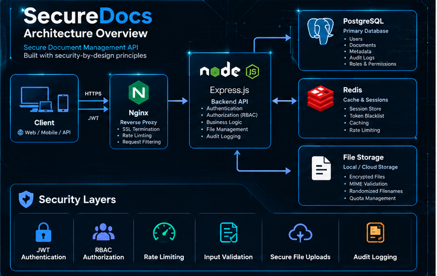
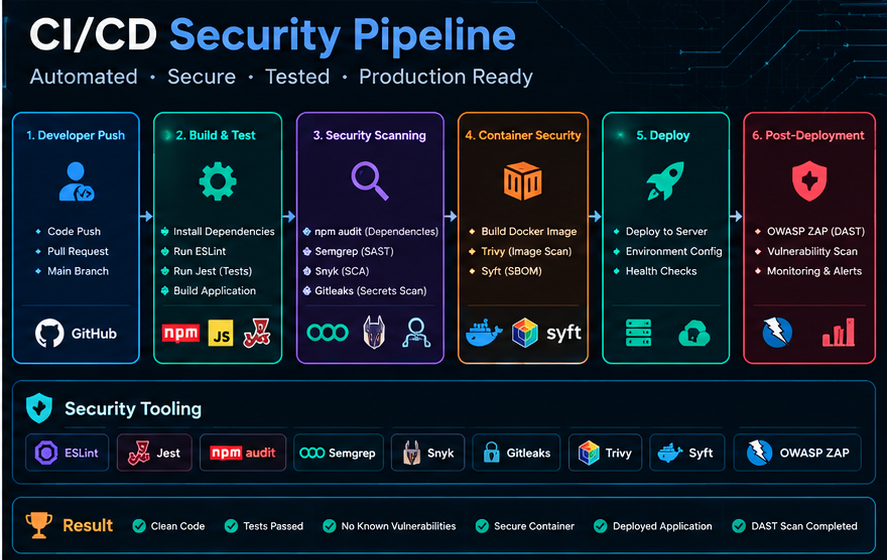
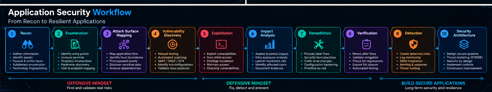

 

# 👋 Hi, I'm **Prem Sharma**

### Backend Developer · API Security · Application Security

I build backend systems, break them from an attacker's perspective, 
and engineer the controls that make them harder to break.

&nbsp;

&nbsp;

---

## 🧭 What I Do

<table>
<tr>

<td width="25%" align="center" valign="top">

<h3>🔐 Web & API Security</h3>

OWASP Top 10 
API Security 
BOLA / IDOR 
Authentication

</td>

<td width="25%" align="center" valign="top">

<h3>🛡️ Secure Backend</h3>

Node.js 
Express.js 
PostgreSQL 
Redis

</td>

<td width="25%" align="center" valign="top">

<h3>🎯 Vulnerability Assessment</h3>

SAST 
SCA 
DAST 
Manual Testing

</td>

<td width="25%" align="center" valign="top">

<h3>⚙️ Security Engineering</h3>

Docker 
CI/CD Security 
Threat Modeling 
Security Architecture

</td>

</tr>
</table>

---

## 🚀 Featured Work

<table>
<tr>

<td width="33%" valign="top">

<h3>🔐 SecureDocs</h3>

<strong>Secure Document Management API</strong>

Backend application focused on secure API architecture and security-by-design.

<strong>Engineering</strong>

<ul>
<li>20+ REST API endpoints</li>
<li>Modular controller/service architecture</li>
<li>PostgreSQL schema design</li>
<li>Redis cache-aside</li>
<li>Pagination</li>
</ul>

<strong>Security</strong>

<ul>
<li>JWT authentication</li>
<li>Refresh-token rotation</li>
<li>RBAC + ownership authorization</li>
<li>Rate limiting</li>
<li>Audit logging</li>
<li>Secure file uploads</li>
</ul>

<a href="https://github.com/SharmaPrem9567/SecureDocs"><strong>View Repository →</strong></a>

</td>

<td width="33%" valign="top">

<h3>🔍 SecureVault</h3>

<strong>Node.js REST API Security Assessment</strong>

Full application-security assessment combining automated and manual testing.

<strong>Testing</strong>

<ul>
<li>Semgrep SAST</li>
<li>Snyk SCA</li>
<li>npm audit</li>
<li>OWASP ZAP DAST</li>
<li>Manual code review</li>
<li>Finding validation</li>
</ul>

<strong>Findings</strong>

<ul>
<li>Dependency CVEs</li>
<li>DOM XSS</li>
<li>CSP/CORS misconfiguration</li>
<li>Mass assignment</li>
<li>Insecure JWT session persistence</li>
</ul>

</td>

<td width="33%" valign="top">

<h3>🔴 OWASP Juice Shop</h3>

<strong>Black-Box Web Application Pentest</strong>

Hands-on assessment focused on discovering, validating and documenting exploitable vulnerabilities.

<strong>Findings</strong>

<ul>
<li>BOLA / IDOR</li>
<li>User enumeration</li>
<li>Brute force</li>
<li>Rate limiting flaws</li>
<li>SSRF</li>
</ul>

<strong>Deliverables</strong>

<ul>
<li>Attack chains</li>
<li>Evidence</li>
<li>CVSS scoring</li>
<li>Root-cause analysis</li>
<li>Remediation guidance</li>
</ul>

</td>

</tr>
</table>

---

## 🏗️ SecureDocs — Security by Design

Backend architecture and security controls represented visually — JWT, RBAC, Redis-backed sessions, PostgreSQL, secure uploads, rate limiting and audit logging.

| Security Layer | Controls |
|---|---|
| 🔐 Authentication | JWT verification, refresh-token rotation, replay detection |
| 🛡️ Authorization | RBAC + document ownership validation |
| 🔑 Session Security | Redis-backed session/revocation store |
| 🚨 Abuse Prevention | Rate limiting + temporary account lockout |
| 🔄 Password Recovery | Hashed OTPs, 5-minute TTL, rate-limited verification |
| 📁 File Security | MIME validation, extension allowlist, randomized filenames, quotas |
| 🌐 API Security | Helmet, CORS restrictions, secure HttpOnly cookies |
| 📊 Auditing | User, timestamp and IP-based audit events |
| 🧠 Threat Modeling | STRIDE-driven security decisions |

---

## ⚙️ Secure CI/CD Pipeline

Security gates across build, test, SAST, SCA, secrets scanning, container scanning, SBOM generation, deployment and DAST.

<code>Semgrep</code> · <code>Snyk</code> · <code>npm audit</code> · <code>Gitleaks</code> · <code>Trivy</code> · <code>Syft</code> · <code>OWASP ZAP</code>

> Deployment and DAST stages are currently being developed.

---

## 🎯 Vulnerabilities I've Practiced

<table>
<tr>

<td width="25%" valign="top">

<h3>🔐 Authentication</h3>

<ul>
<li>JWT attacks</li>
<li>Session security</li>
<li>Authentication bypass</li>
<li>User enumeration</li>
</ul>

</td>

<td width="25%" valign="top">

<h3>🛡️ Authorization</h3>

<ul>
<li>BOLA / IDOR</li>
<li>Broken access control</li>
<li>Mass assignment</li>
<li>Privilege escalation</li>
</ul>

</td>

<td width="25%" valign="top">

<h3>💉 Injection</h3>

<ul>
<li>SQL Injection</li>
<li>XSS</li>
<li>SSTI</li>
</ul>

</td>

<td width="25%" valign="top">

<h3>🌐 Server-Side</h3>

<ul>
<li>SSRF</li>
<li>Path traversal</li>
<li>File upload bypass</li>
</ul>

</td>

</tr>
</table>

---

## 🧪 Security Testing Toolkit

<table>
<tr>
<td width="33%" valign="top">

<h3>🌐 Web & API Pentesting</h3>

Burp Suite · OWASP ZAP · Nmap · Nuclei · ffuf · Gobuster · Nikto · SQLmap · Metasploit · Wireshark · Netcat

</td>

<td width="33%" valign="top">

<h3>🛡️ Application Security</h3>

Semgrep · Snyk · npm audit · Gitleaks · Trivy · Syft

</td>

<td width="33%" valign="top">

<h3>🎯 Platforms</h3>

TryHackMe · Hack The Box · PortSwigger Web Security Academy · OverTheWire

</td>
</tr>
</table>

---

## 🧠 Security Labs & Attack Chains

### PortSwigger Web Security Academy

**30+ hands-on labs**

`SQL Injection` · `XSS` · `SSRF` · `JWT Attacks` · `Authentication Bypass` · `Broken Access Control`

### TryHackMe

<a href="https://tryhackme.com/p/Blastoiz"><strong>TryHackMe Profile →</strong></a>

<table>
<tr>
<td width="33%" valign="top">

<strong>VulnNet: DotPy</strong>

`SSTI → RCE → Privilege Escalation → Root`

</td>

<td width="33%" valign="top">

<strong>RootMe</strong>

`File Upload → RCE → SUID Privilege Escalation → Root`

</td>

<td width="33%" valign="top">

<strong>Overpass</strong>

`Session Authentication Flaw → Unauthorized Admin Access`

</td>
</tr>
</table>

### Hack The Box

Hands-on practice with vulnerable machines covering:

`Enumeration` · `Exploitation` · `Privilege Escalation` · `Linux` · `Active Directory`

---

## ✍️ Security Writeups

I document what I learn instead of simply completing labs.

<table>
<tr>
<td width="50%" valign="top">

- 🔥 XSS exploitation & filter bypass
- 💉 SQL Injection — manual & automated
- 🔐 JWT attacks & session security
- 🆔 IDOR / BOLA
- 🛡️ Authentication & authorization
- 🌐 API security

</td>

<td width="50%" valign="top">

- 🐳 Docker security
- ⚙️ CI/CD security
- 🖥️ Linux privilege escalation
- 🎯 Full CTF attack chains
- 📊 CVSS-based vulnerability reporting
- 🔧 Root-cause analysis & remediation

</td>
</tr>
</table>

<a href="https://medium.com/@premwork25"><strong>Read my Medium articles →</strong></a>

---

## 📊 GitHub Analytics

  

---

## 📈 Contribution Activity

---

## 💻 Backend Engineering

My backend development experience is the foundation of my move into Application Security.

<table>
<tr>
<td><strong>Development</strong></td>
<td>JavaScript · Node.js · Express.js · REST APIs</td>
</tr>
<tr>
<td><strong>Databases</strong></td>
<td>PostgreSQL · MongoDB · MySQL · Redis</td>
</tr>
<tr>
<td><strong>Infrastructure</strong></td>
<td>Linux · Docker · Docker Compose · Nginx</td>
</tr>
<tr>
<td><strong>DevOps</strong></td>
<td>Git · GitHub Actions · Jenkins</td>
</tr>
<tr>
<td><strong>Engineering</strong></td>
<td>Modular Architecture · Authentication · Authorization · Caching · Rate Limiting · Pagination · API Design</td>
</tr>
</table>

---

## 📚 Currently Learning

<table>
<tr>
<td width="50%" valign="top">

### Application Security

- Secure API Design
- Threat Modeling
- Security Architecture
- CI/CD Security

</td>

<td width="50%" valign="top">

### Security Engineering

- Container Security
- Cloud Security
- Detection Engineering
- Advanced Web Exploitation

</td>
</tr>
</table>

---

## 🧭 My Security Workflow

<blockquote>
I don't want to stop at <strong>"I found a vulnerability."</strong>  

<strong>Why did it happen?</strong> → How can it be exploited? → What's the impact? 
→ How should it be fixed? → How can the fix be verified? 
→ How can we detect it? → How do we prevent it architecturally?
</blockquote>

---

## 🤝 Let's Connect

  

<strong>🔐 Build. Break. Secure.</strong>

 

<em>Backend engineering + offensive security + secure architecture.</em>

